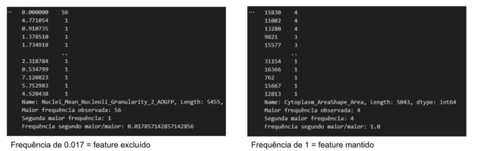
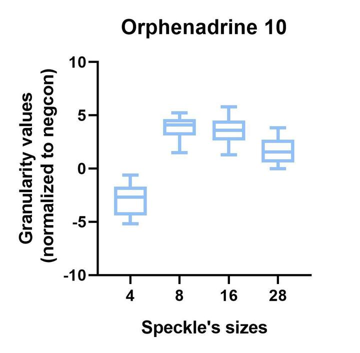

# Interpreting Image-Based Profiles

It can be very hard to interpret image-based profiles, we get it. So here's some information we gathered about it:

## Articles

This protocol paper can help:

## Features and interpretations

Here we have some interpretations made by me by reading the papers and manuals etc, in Portuguese.

1. Variance threshold operation (pycytominer)

Existem 4 métodos para exclusão de features pelo pycytominer. O que eu achei mais complicado de entender foi o chamado variance_threshold (o que é um pouco enganoso porque não segue o mesmo padrão do sklearn pra variancethreshold, então cuidado aqui), mas pra quem quiser entender melhor, aqui vai:
Código do variance_threshold: https://github.com/cytomining/pycytominer/blob/main/pycytominer/operations/variance_threshold.py
A avaliação da variância de uma característica pelo pycytominer é avaliada pela frequência com que os valores das features aparecem. Ao contar o número de vezes que os valores aparecem, obtém-se uma tabela de frequência. Dessa tabela, o primeiro e o segundo valor que mais aparecem são utilizados para calcular a frequência do segundo pelo primeiro mais comum. Por exemplo, se para a feature X o valor mais comum aparece 56 vezes e o segundo valor mais comum aparece 1 vez, essa razão será 0.017 (1/56). Já se o valor mais comum da feature Y aparece 4 vezes e o segundo mais comum 3 vezes, a razão é de 0.75 (3/4). A exclusão da feature acontece se a frequência for menor do que 0.05; assim, a feature X será excluída (0.017 < 0.05) e a feature Y mantida (0.75 > 0.05). Essa técnica exclui features que tem um valor dominante e outros valores que ocorrem raramente.
Os dois exemplos eu rodei no python pra entender na prática como o código funciona e estão na imagem em anexo.

2. Granularity texture (CellProfiler)

Usar a granularidade pra medir tamanho de objetos na imagem é relativo - é preciso comparar em relação ao controle, por exemplo, se existem mais ou menos objetos daquele tamanho na sua imagem;
Que é necessário ter em mente o valor de "Subsampling factor for granularity measurements", pois os cálculos do tamanho dos objetos depende desse valor (o padrão é 0.25). Então a feature "Cells_Granularity_4_CorrPI" significa que se está avaliando objetos na faixa de tamanho de 16 pixels (4/0.25);
É uma feature que aparece muito nas análises e poucas são excluídas pela seleção de features - então elas trazem muita info. A gente só precisa aprender a interpretá-las corretamente!
A feature de granularidade (medida pelo módulo MeasureGranularity) é uma medida de textura que vai tentar encaixar vários elementos estruturais de tamanhos crescentes à imagem. O módulo tem como saída medidas que vão dizer quão bem esses elementos fitaram. O primeiro passo desse módulo é reduzir a resolução da imagem (padrão redução 0.25); o segundo passo é subtrair do background qualquer objeto maior do que o raio dado (no CellProfiler, é a configuração do "Radius of structuring element"); e esse script vai rodar o número de vezes dado (também no CellProfiler em "Range of the granular spectrum", padrão = 10). Cada vez que esse script rodar, ele vai aplicar um filtro na imagem e erodir 1 pixel brilhante, no próximo round 2 pixels brilhantes, e assim até completar 10 rounds. Em cada round, o programa retorna qual a porcentagem de sinal que foi perdida entre um round e outro.
No fim, o resultado é relativo - se naquele round em que o filtro era de 6 pixels, por exemplo, perdeu-se uma porcentagem X de sinal, então significa que tinha mais ou menos objetos brilhantes com tamanho de 6 pixels, comparando com um controle negativo, por exemplo.
Sem esquecer que se a imagem foi reduzida pelo padrão de 0.25, então os valores dados na configuração do módulo devem levar isso em consideração (por exemplo,  "Radius of structuring element" = 3 com um subsampling de 0.25 significa que tudo maior que 12 pixels (3 / 0.25) vai ser filtrado).
E a escala de granularidade que aparece depois no nome do feature - Cells_Granularity_4_CorrPI, o valor de 4 dividido pelo subsampling factor de 0.25 vai dar 16, o que significa que os valores dessa feature "Cells_Granularity_4_CorrPI" vão dizer sobre a quantidade de objetos/pixels na imagem com o tamanho de 16 pixels.
Trouxe um exemplo na imagem em anexo mostrando valores de granularidade pra alguns compostos comparado com o controle negativo (non-treated), e como alguns tem objetos maiores ou menores quando comparado ao controle (como os valores da feature são normalizados para o controle negativo, então todo valor já está em relação ao controle - se ele é acima de 0, significa que tem mais objetos do que o controle daquele tamanho, ou se é abaixo de zero, tem menos objetos do que o controle naquele tamanho).
Um plot só do Orphenadrine dá pra entender melhor como esse composto induz a formação de vesículas maiores: ele induz a formação de vesículas maiores do que do controle no tamanho de 8, 16 e 28 pixels.
Referências:
https://forum.image.sc/t/cellprofiler-granularity-measurements/36966/2
https://cellprofiler-manual.s3.amazonaws.com/CellProfiler-4.2.6/modules/measurement.html#measuregranularity

