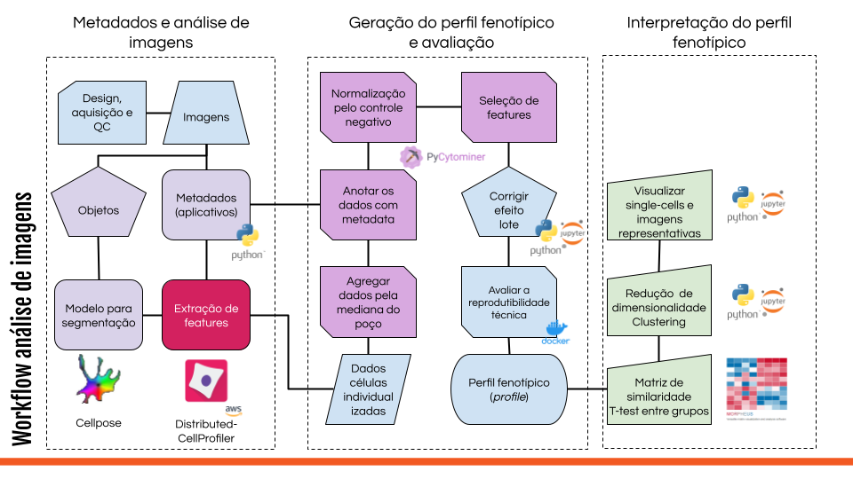

# Welcome

## Provide image-based profiling content in Portuguese and English

This book was created to contain all the materials, and videos, and to organize most information about image-based profiling acquired by Fernanda Fossa during her Ph.D. 

Her journey started as a biologist, acquiring fluorescent microscopic images from cells. But something was missing - quantifying all the images was a desire, and she started in the field of image analysis to fulfill that need. 

## Why to use this book

This book aims to provide written material in English, which can be easily translated into Portuguese.

We also prepared videos for each of the topics in Portuguese, and the slides are in English.

This content was produced from a mix of literature, experience, and trial and error.

Please use this content as a way to initiate image-based profiling and understand how to organize your data and analyze it. 

Happy image analysis! 😃